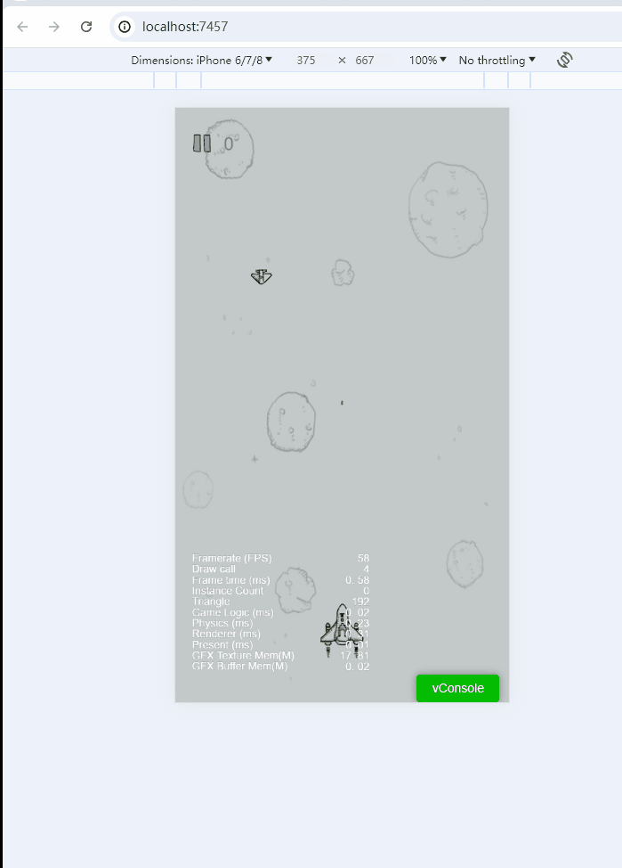

# <p align="center">使用cocos引擎开发的飞机大战游戏（cocos creator3.x）</p>

[//]: # (https://github.com/ikatyang/emoji-cheat-sheet 表情仓库)


## 🎞️ 项目介绍

> 使用cocos游戏引擎 和 cocos creator3.x IDE开发的入门级游戏教程。 \
> 以下是通过项目生成的原始示例，未经任何修改：
> 


## 🛸 通过cocos creator3.x导入项目


## 🎨 项目结构

```
├── AirplaneWarTwo         # 飞机大战
├── assets                 # 全部资源目录
│   ├── prefabs/              # 预制体相关ts代码的集合
│   ├── resources             # 资源文件目录（包括图片、音频、动画等）     
│   ├── scripts/              # 游戏自定义脚本
│   ├── sscene.scene          # 游戏场景
├── bin                    # 测试运行的index.html首页的入口，以及IDE内置的代码入口（如html/bundle.js） - 开发不要动
├── library                # 开发不要动
├── temp                   # 缓存文件夹
├── src                    # 项目源码目录
│   ├── prefab/               # 预制体相关ts代码的集合
│   ├── main.ts               # 入口启动场景的脚本（也可以换别的，这个自己设置）     
│   ├── utils/                # 公共工具类
├── .gitignore             # git忽略配置
├── package.json           # 依赖表
└── tsconfig.json          # ts配置文件
```

## 🔗 语雀链接

## 🌟 Star History
<br>

[](https://gitee.com/game-projects_1/airplane-war-cc/stargazers)
